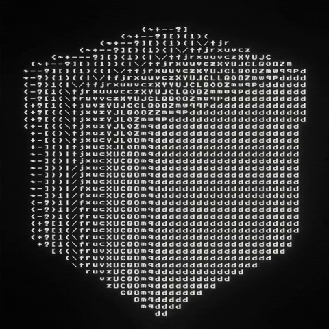
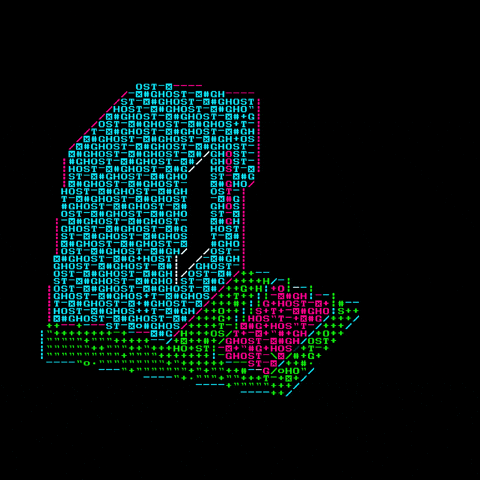

<h1 align="center">Wᴇʟᴄᴏᴍᴇ ᴛᴏ ᴍʏ ᴘʀᴏғɪʟᴇ!</h1>

    

<h3 align="center">
    Software should be understandable. 
    Software should be composable. 
    Software should be under the user's control. 
    Complexity should be a consequence of necessity, not convenience.
</h3>

<h2 align="center">Aʙᴏᴜᴛ ᴍᴇ</h2>

    Linux enthusiast • Student 
    Systems programming • C • POSIX shell 
    Linux internals • Low-level systems • Software architecture 
    Open source • Back-end development

    
    
     
    

<h2 align="center">Pʀᴏᴊᴇᴄᴛs</h2>

    <b><a href="https://github.com/VindLinux">Vind Linux</a></b> — A Linux distribution focused on simplicity, control, and minimalism.

    <b><a href="https://github.com/VindLinux/lambda-manager">Lambda</a></b> — A lightweight package manager designed for Vind Linux.

<h2 align="center">Cᴜʀʀᴇɴᴛʟʏ</h2>

    Building Vind Linux 
    Learning C and systems programming 
    Exploring POSIX and Linux internals 
    Working on Lambda and the Vind package ecosystem

<h2 align="center">Tᴇᴄʜɴᴏʟᴏɢɪᴇs</h2>

    

    
    
    
    
    
    

<h2 align="center">Qᴜᴏᴛᴇs</h2>

    “The UNIX philosophy is to write programs that do one thing and do it well.” 
    — Doug McIlroy 
    “The most disastrous thing that you can ever learn is your first programming language.” 
    — Alan Kay 
    “I don't believe in God because I don't believe in anything that cannot be demonstrated.” 
    — Richard Feynman

